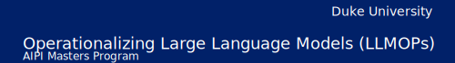

# 

# Large Language Model Operations (LLMOps) course

* Syllabus for [Artificial Intelligence for Product Innovation](https://ai.meng.duke.edu/degree) Master of Engineering
* [AIPI 561: Operationalizing Large Language Models (LLMOPs)](https://ai.meng.duke.edu/courses#operations-core)
* [Rubric](./rubric.md)

### Course Description

In this course, you will learn about the methodologies involved in operationalizing Large Language Models. By the end of the course, you will be able to develop applications that use software development best practices with large language models.

**Faculty**
* [Prof. Noah Gift Contact & Bio](https://datascience.duke.edu/noah-gift)
* [Prof. Alfredo Deza Contact & Bio](https://ene.duke.edu/faculty/alfredo-deza)

  
<b>Table of Contents</b>

   

* [Prerequisites](#prerequisites)
* [Week 1: Introduction to Generative AI Concepts](#week-1-introduction-to-generative-ai-concepts)
* [Week 2: Setup Development Environment](#week-2-setup-development-environment)
* [Week 3: Interacting with Large Language Models](#week-3-interacting-with-large-language-models)
* [Week 4: Using Local Large Language Models](#week-4-using-local-large-language-models)
* [Week 5: Applied Solutions with LLMs](#week-5-applied-solutions-with-llms)
* [Week 6: Extensibility Using Plugins and Functions](#week-6-extensibility-using-plugins-and-functions)
* [Week 7: Using Retrieval Augmented Generation](#week-7-using-retrieval-augmented-generation)
* [Week 8: Introduction to Python Web Frameworks for APIs](#week-8-introduction-to-python-web-frameworks-for-apis)
* [Week 9: DevOps Principles](#week-9-devops-principles)
* [Week 10: Deploying Machine Learning APIs](#week-10-deploying-machine-learning-apis)
* [Week 11: LLM Platforms](#week-11-llm-platforms)
* [Week 12: Final Presentations](#week-12-final-presentations)

  

## Course Objectives

By the end of the course, you will be able to:
* Build Large Language Model (LLM) or Small Language Model (SLM) solutions
* Build, share and present compelling portfolios using:  Github, YouTube, and Linkedin.
* Setup a provisioned project environment
* Develop a non-linear life-long learning skill

> [!NOTE]
> **Diversity Statement:** As educators and learners, we must share a commitment to diversity and equity, removing barriers to education so that everyone may participate fully in the community. In this course, we respect and embrace the unique experiences that brought each person here, including backgrounds, identities, learning styles, ways of expression, and academic interests. The broad spectrum of perspectives represented by our students enrich everyone’s experiences, and we strive to meet each perspective with openness and respect.

### Prerequisites

This course requires basic Linux and programming skills. You can complete all
coursework with either Python or Rust. Use the following recommendations to get
up to speed on these skills.

**Linux**
If students lack basic Linux skills it is recommended to take this course: [Duke+Coursera:  Python, Bash and SQL Essentials for Data Engineering Specialization](https://www.coursera.org/specializations/python-bash-sql-data-engineering-duke)

> [!IMPORTANT]
> You don't need both programming languages for this course, you can pick
> either or.

**Python**

These two modules from the Introduction to Python course covers the basics of
Python:

* [Python Essentials for MLOps-Week1-Introduction to Python](https://www.coursera.org/learn/python-essentials-mlops-duke/home/week/1)
* [Python Essentials for MLOps-Week2-Python Functions and Classes](https://www.coursera.org/learn/python-essentials-mlops-duke/home/week/2)

**Rust**

This course on [Rust Fundamentals](https://www.coursera.org/learn/rust-fundamentals) covers the basics of the Rust Programming
Language.

#### Additional Resources
Although this course is based on the [Large Language Model Operations (LLMOPs)
specialization](https://www.coursera.org/specializations/large-language-model-operations), you can use these additional resources as supporting material:

Courses:

* [Duke+Coursera: Large Language Model Operations (LLMOps) Specialization](https://www.coursera.org/specializations/large-language-model-operations)
* [Duke+Coursera: MLOps, Machine Learning Operations Specialization](https://www.coursera.org/specializations/mlops-machine-learning-duke)
* [Rust Programming Specialization](https://www.coursera.org/specializations/rust-programming)
* [Duke+Coursera:  Cloud Computing for Data Coursera Course](https://www.coursera.org/specializations/building-cloud-computing-solutions-at-scale)

Books:

* [Practical MLOps](https://learning.oreilly.com/library/view/practical-mlops/9781098103002/)
* [Python for DevOps](https://learning.oreilly.com/library/view/python-for-devops/9781492057680/)

## 12 week Syllabus

These are all the resources you need for this course. 

> [!IMPORTANT]
> You are not required to watch and read every single resource. You aren't graded on consumption of content or memorization of
> facts. Use the content as support for your project.

### Week 0 (Optional):  Refresh Python or Rust Skills

**Rust**:
* [Rust Fundamentals](https://www.coursera.org/learn/rust-fundamentals)

**Python**:
* [Python Essentials for MLOps-Week1-Introduction to Python](https://www.coursera.org/learn/python-essentials-mlops-duke/home/week/1)
* [Python Essentials for MLOps-Week2-Python Functions and Classes](https://www.coursera.org/learn/python-essentials-mlops-duke/home/week/2)
* [Python Essentials for MLOps-Week4-Introduction to Pandas and NumPy](https://www.coursera.org/learn/python-essentials-mlops-duke/home/week/4)

### Week 1: Introduction to Generative AI concepts
* [Introduction to Generative AI](https://www.coursera.org/learn/intro-gen-ai/home/week/1)
* [Public Speaking](https://github.com/microsoft/workshop-library/tree/main/short/public-speaking)
* [Developing Effective Technical Communication](https://www.coursera.org/learn/cloud-computing-foundations-duke/home/week/2)
* [Exploring Cloud Onboarding](https://www.coursera.org/learn/cloud-computing-foundations-duke/home/week/3)

**Weekly Demo video prompt:** Discuss your plan and idea to build out your individual project and how you will do them on time. Use the [Public Speaking](https://github.com/microsoft/workshop-library/tree/main/short/public-speaking) guidelines to make sure you are delivering great demos.

### Week 2: Setup Development Environment

Python:

* [Python Development Environments](https://www.coursera.org/learn/python-and-pandas-for-data-engineering-duke/home/week/4)_
* [Pytest Master Class](https://learning.oreilly.com/videos/pytest-master-class/10132021VIDEOPAIML/)
* [Python Essentials for MLOps-Week5-Applied Python for MLOps](https://www.coursera.org/learn/python-essentials-mlops-duke/home/week/5)

Rust:

* [Setting up your Rust Development
  environment](https://www.coursera.org/learn/rust-fundamentals/home/week/1)

**Weekly Demo video prompt:** Describe your programming language choice and what are some of the advantages and potential pitfalls.

### Week 3: Interacting with Large Language Models
* [Interacting with models](https://www.coursera.org/learn/intro-gen-ai/home/week/2)
* [Building robust Generative AI systems](https://www.coursera.org/learn/intro-gen-ai/home/week/3)
* [Introduction to MLOps Walkthrough](https://learning.oreilly.com/videos/introduction-to-mlops/607312021VIDEOPAIML/)
* [MLOPs Foundations: Chapter 2 Walkthrough of Practical MLOps](https://learning.oreilly.com/videos/mlops-foundations-chapter/607082021VIDEOPAIML/)
* [Chapter 1:  Introduction to MLOps](https://learning.oreilly.com/library/view/practical-mlops/9781098103002/ch01.html)
* [Chapter 2. MLOps Foundations](https://learning.oreilly.com/library/view/practical-mlops/9781098103002/ch02.html)

**Weekly Demo video prompt:** Explain what are some challenges for your application when working with Large Language Model output and what you will do to mitigate them.

### Week 4: Using Local Large Language Models
* [Beginning Llamafile for Local Large Language Models (LLMs)](https://www.coursera.org/learn/llamafile-local-llm)
* [Getting Started with Open Source Ecosystem](https://www.coursera.org/learn/open-source-llmops-solutions/home/week/1)
* [Foundations of Local Large Language Models](https://www.coursera.org/learn/local-large-language-models)

**Weekly Demo video prompt:** Describe your evaluation of the different Local Large Language and Small Language Models available with Llamafile and which one would work best for your project.

### Week 5: Applied solutions with LLMs
* [Local LLMOps](https://www.coursera.org/learn/databricks-to-local-llms/home/week/4)
* [AI Pair Programming from CodeWhisperer to Prompt Engineering](https://www.coursera.org/learn/genai-llm-aws/home/week/2)
* [Using Local LLMs from Llamafile to Whisper.cpp](https://www.coursera.org/learn/open-source-llmops-solutions/home/week/2)
* [Open Source Platforms for MLOps-Week2-Introduction to Hugging Face](https://www.coursera.org/learn/open-source-mlops-platforms-duke/home/week/2)
* [Open Source Platforms for MLOps-Week3-Deploying Hugging Face](https://www.coursera.org/learn/open-source-mlops-platforms-duke/home/week/3)
* [Open Source Platforms for MLOps-Week4-Applied Hugging Face](https://www.coursera.org/learn/open-source-mlops-platforms-duke/home/week/4)

**Weekly Demo video prompt:** Explain the architectural overview of your application and what are some challenges with this type of design.

### Week 6: Extensibility using plugins and functions

* [Extending with Functions and Plugins](https://www.coursera.org/learn/llmops-azure/home/week/3)
* [Applications of LLMs](https://www.coursera.org/learn/intro-gen-ai/home/week/4)
* [MLOps Platforms: Amazon SageMaker and Azure ML-Week1](https://www.coursera.org/learn/mlops-aws-azure-duke/home/week/1)

**Weekly Demo video prompt:** What are some benefits of adding plugins and functions to your application idea? What would be a challenge in a production environment?

### Week 7: Using Retrieval Augmented Generation

* [Introduction to Retrieval Augmented Generation (RAG)](https://www.coursera.org/projects/introduction-to-rag)
* [Emerging Topics in Machine Learning](https://www.coursera.org/learn/cloud-machine-learning-engineering-mlops-duke/home/week/3)

**Weekly Demo video prompt:** How would adding RAG to your application affect the overall experience for an end user? Why or why wouldn't you consider using RAG in your application?

### Week 8: Introduction to Python web frameworks for APIs
* [Introduction to FastAPI Framework](https://www.coursera.org/projects/introduction-to-fastapi-framework)
* [Introduction to Flask Framework](https://www.coursera.org/projects/introduction-to-flask-framework)
* [Applied Python for MLOPs](https://www.coursera.com/learn/python-mlops-duke/home/week/5)
* [Cloud Virtualization, Containers and APIs](https://www.coursera.org/learn/cloud-virtualization-containers-api-duke/home/week/3)

**Weekly Demo video prompt:** What are some benefits of using the framework you chose? Describe how you will make it work with your application.

### Week 9: DevOps Principles
* [Responsible Generative AI](https://www.coursera.org/learn/databricks-to-local-llms/home/week/3)
* [Applying DevOps Principles](https://www.coursera.org/learn/cloud-computing-foundations-duke/home/week/5)
* [MLOps Platforms: Amazon SageMaker and Azure ML-Week2](https://www.coursera.org/learn/mlops-aws-azure-duke/home/week/2)
* [MLOps Platforms: Amazon SageMaker and Azure ML-Week3](https://www.coursera.org/learn/mlops-aws-azure-duke/home/week/3)

**Weekly Demo video prompt:** How would you apply DevOps, Responsible AI Principles, and automation for your application? What are some challenges you may face?

### Week 10: Deploying Machine Learning APIs

* [Introduction to GitHub Actions](https://www.coursera.org/projects/introduction-to-github-actions)
* [Building an End-to-End LLM application in Azure](https://www.coursera.org/learn/llmops-azure/home/week/4)
* [Operations](https://www.coursera.org/learn/cloud-virtualization-containers-api-duke/home/week/4)

**Weekly Demo video prompt:** What are some difficulties of using automation? How will using automation benefit your application?

### Week 11: LLM Platforms
* [Introduction to LLMOps with Azure](https://www.coursera.org/learn/llmops-azure/home/week/1)
* [mlflow-project-best-practices](https://github.com/noahgift/mlflow-project-best-practices)
* [MLOps Platforms From Zero: Databricks, MLFlow/MLRun/SKLearn](https://learning.oreilly.com/videos/mlops-platforms-from/032232022VIDEOPAIML/)
* [Azure Databricks, Pandas, and Opendatasets](https://learning.oreilly.com/videos/azure-databricks-pandas/50132VIDEOPAIML/)
* [MLOps Platforms: Amazon SageMaker and Azure ML-Week5](https://www.coursera.org/learn/mlops-aws-azure-duke/home/week/5)
* [MLOps Platforms: Amazon SageMaker and Azure ML-Week4](https://www.coursera.org/learn/mlops-aws-azure-duke/home/week/4)

**Weekly Demo video prompt:** How would adding a cloud platform enable your application? What are some potential drawbacks in using an LLM platform?

### Week 12: Final Presentations

* Turn in Final Project

### Course Project

This class is based on a single and individual class project. You will start
work on this project from Week 1 and will deliver the completed project with
final presentation on Week 12.

See the [rubric](./rubric.md) for more details.

> [!IMPORTANT]
> **Do not build a model yourself**. Reuse a LLM or an SLM model. Use [Mozilla Llamafile](https://github.com/Mozilla-Ocho/llamafile) as a reference.

The primary two resources you will need to build an LLM solution using a local
API are these:

1. [Beginning Llamafile for Local Large Language Models (LLMs)](https://www.coursera.org/learn/llamafile-local-llm)
1. [Getting Started with Open Source Ecosystem](https://www.coursera.org/learn/open-source-llmops-solutions/home/week/1)

#### Machine Learning References

* [Hugging Face](https://huggingface.co/)
* [TensorFlow Hub](https://www.tensorflow.org/hub)
* [Classify text with BERT](https://www.tensorflow.org/text/tutorials/classify_text_with_bert)

#### AutoML References

* [AutoML with CreateML](https://learning.oreilly.com/videos/automl-with-apple/60424VIDEOPAIML/60424VIDEOPAIML-c1_s0/)
* [AutoML and KaizenML](https://learning.oreilly.com/library/view/practical-mlops/9781098103002/ch05.html)

#### Python References

* [Python MLOps Cookbook](https://github.com/noahgift/Python-MLOps-Cookbook)
* [databricks-zero-to-mlops](https://github.com/noahgift/databricks-zero-to-mlops)
* [Python Fire](https://learning.oreilly.com/videos/quickstart-python-fire/040812022VIDEOPAIML/) 
* [Refactoring a Python script into a library called by Python Click CLI](https://learning.oreilly.com/videos/refactoring-a-python/04082022VIDEOPAIML/)
* [Container Continuous Delivery](https://learning.oreilly.com/videos/container-continuous-delivery/012632022VIDEOPAIML/)
* [Functions to Containerized Microservice Continuous Delivery to AWS App Runner with Fast API](https://learning.oreilly.com/videos/functions-to-containerized/04072022VIDEOPAIML/)

### Referenced Media and Resources

* [mlflow-project-best-practices](https://github.com/noahgift/mlflow-project-best-practices)
* [databricks-zero-to-mlops](https://github.com/noahgift/databricks-zero-to-mlops)
* [Python MLOps Cookbook](https://github.com/noahgift/Python-MLOps-Cookbook)
* [Edge Computer Vision](https://github.com/noahgift/edge-computer-vision)
* [Github Codespaces](https://github.com/features/codespaces)
* [AWS Academy](https://www.awsacademy.com/SiteLogin)
* [Azure for Students](https://azure.microsoft.com/en-us/developer/students/#build)
* [Google Qwiklabs](https://www.qwiklabs.com/)
* [Practical MLOps](https://learning.oreilly.com/library/view/practical-mlops/9781098103002/)
* [Pragmatic AI](https://learning.oreilly.com/library/view/pragmatic-ai-an/9780134863924/)

#### Optional Supplementary Readings & Media

* [AWS Bootcamp](https://github.com/noahgift/aws-bootcamp)
* Gift, N (2020) [Python for DevOps](https://learning.oreilly.com/library/view/python-for-devops/9781492057680/) Sebastopol, CA: O'Reilly.
* Gift, N (2021) [Practical MLOps](https://learning.oreilly.com/library/view/practical-mlops/9781098103002/), Sebastopol, CA: O'Reilly
* Gift, N (2021) [Cloud Computing for Data Analysis](https://paiml.com/docs/home/books/cloud-computing-for-data/)
* Gift, N (2020) [Pragmatic AI:  An Introduction to Cloud-Based Machine Learning](https://learning.oreilly.com/library/view/pragmatic-ai-an/9780134863924/)
* [AWS Training & Certification](https://www.aws.training/)
* [AWS Educate](https://www.awseducate.com/educator/s/pathways)
* [AWS Academy](https://aws.amazon.com/training/awsacademy/)
* [Google Qwiklabs - Hands-On Cloud Training](https://www.qwiklabs.com/)
* [Coursera](https://www.coursera.org/)
    * [Google Cloud Platform Fundamentals: Core Infrastructure](https://www.coursera.org/learn/gcp-fundamentals)
* [Microsoft Learn](https://docs.microsoft.com/en-us/learn/)
* [edX](https://www.edx.org/)
* Applied Computer Vision with Python Lectures: [https://learning.oreilly.com/videos/applied-computer-vision/60652VIDEOPAIMLL/](https://learning.oreilly.com/videos/applied-computer-vision/60652VIDEOPAIMLL/)
* Learn Python in One Hour:  [https://learning.oreilly.com/videos/learn-python-in/60645VIDEOPAIML/](https://learning.oreilly.com/videos/learn-python-in/60645VIDEOPAIML/)
* Cloud Computing with Python: [https://learning.oreilly.com/videos/cloud-computing-with/60650VIDEOPAIML/](https://learning.oreilly.com/videos/cloud-computing-with/60650VIDEOPAIML/)
* Python for Data Science with Colab and Pandas in One Hour:  [https://learning.oreilly.com/videos/python-for-data/62062021VIDEOPAIML/](https://learning.oreilly.com/videos/python-for-data/62062021VIDEOPAIML/)
* GCP Cloud Functions: \
[https://learning.oreilly.com/videos/learn-gcp-cloud/50101VIDEOPAIML/](https://learning.oreilly.com/videos/learn-gcp-cloud/50101VIDEOPAIML/)
* Azure AutoML \
[https://learning.oreilly.com/videos/learn-azure-ml/50104VIDEOPAIML/](https://learning.oreilly.com/videos/learn-azure-ml/50104VIDEOPAIML/)

##### AWS

* AWS Cloud Practitioner
    * AWS Certified Cloud Practitioner Video Course: [https://learning.oreilly.com/videos/aws-certified-cloud/60644VIDEOPAIML/](https://learning.oreilly.com/videos/aws-certified-cloud/60644VIDEOPAIML/)
    * [https://learning.oreilly.com/library/view/cloud-computing-for/20201229PAIML/](https://learning.oreilly.com/library/view/cloud-computing-for/20201229PAIML/)
    * [https://learning.oreilly.com/videos/aws-in-one/61092021VIDEOPAIMLL/](https://learning.oreilly.com/videos/aws-in-one/61092021VIDEOPAIMLL/)
* AWS ML
    * [https://learning.oreilly.com/videos/aws-certified-machine/9780135556597/](https://learning.oreilly.com/videos/aws-certified-machine/9780135556597/)
    * [https://learning.oreilly.com/videos/aws-machine-learning/61232021VIDEOPAIML/](https://learning.oreilly.com/videos/aws-machine-learning/61232021VIDEOPAIML/)
* AWS SA
    * [https://learning.oreilly.com/videos/aws-solutions-architect/61132021VIDEOPAIML/](https://learning.oreilly.com/videos/aws-solutions-architect/61132021VIDEOPAIML/)

##### GCP

* Building AI Applications with GCP: [https://learning.oreilly.com/videos/building-ai-applications/9780135973462/](https://learning.oreilly.com/videos/building-ai-applications/9780135973462/)
* Build GCP Cloud Functions:

    [https://learning.oreilly.com/videos/learn-gcp-cloud/50101VIDEOPAIML/](https://learning.oreilly.com/videos/learn-gcp-cloud/50101VIDEOPAIML/)

##### Python

* Data Science, Pandas, and Colab

[https://learning.oreilly.com/videos/python-for-data/62062021VIDEOPAIML/](https://learning.oreilly.com/videos/python-for-data/62062021VIDEOPAIML/)

* Python and DevOps  \
[https://learning.oreilly.com/videos/python-devops-in/61272021VIDEOPAIML/](https://learning.oreilly.com/videos/python-devops-in/61272021VIDEOPAIML/)
* Python Command-line Tools \
[https://learning.oreilly.com/videos/learn-python-command-line/50102VIDEOPAIML/](https://learning.oreilly.com/videos/learn-python-command-line/50102VIDEOPAIML/)

##### Linux and Systems Engineering

* Docker containers: \
[https://learning.oreilly.com/videos/learn-docker-containers/50103VIDEOPAIML/](https://learning.oreilly.com/videos/learn-docker-containers/50103VIDEOPAIML/)
* Learn the Vim Text Editor:

    [https://learning.oreilly.com/videos/learn-vim-in/50100VIDEOPAIML/](https://learning.oreilly.com/videos/learn-vim-in/50100VIDEOPAIML/)

### Assignment Overview and Grading Breakdown

Grading and feedback turnaround will be one week from the due date. You will be notified if the turnaround will be longer than one week.

The discussion forums, written assignments, demo videos, and final project will be graded based on specific criteria or a rubric. The criteria or rubric for each type of assessment will be available in the course. To view the discussion forum rubric, click the gear icon in the upper right corner of the page and choose Show Rubric. The Written Assignment Rubric and Final Project Rubric will automatically appear on the page.

#### Late Work Policy

Late work will be accepted only in the event of an instructor-approved absence. Contact your instructor as soon as possible, at least 24 hours in advance.

### Online Communication and Interaction Expectations

#### Discussion Forums

The purpose of the discussion boards is to allow students to freely exchange ideas. It is imperative to remain respectful of all viewpoints and positions and, when necessary, agree to respectfully disagree. While active and frequent participation is encouraged, cluttering a discussion board with inappropriate, irrelevant, or insignificant material will not earn additional points and may result in receiving less than full credit. Frequency matters, but contributing content that adds value is paramount. Please remember to cite all sources—when relevant—in order to avoid plagiarism. Please post your viewpoints first and then discuss others’ viewpoints.

The quality of your posts and how others view and respond to them are the most valued. A single statement mostly implying “I agree” or “I do not agree” is not counted as a post. Explain, clarify, politely ask for details, provide details, persuade, and enrich communications for a great discussion experience. Please note, there is a requirement to respond to at least two fellow class members’ posts. Also, remember to cite all sources—when relevant—in order to avoid plagiarism.

#### Online Communication Etiquette

Beyond interacting with your instructor and peers in discussions, you will be expected to communicate by Canvas message, email, and sync session. Your instructor may also make themselves available by phone or text. In all contexts, keep your communication professional and respect the instructor’s posted availability.

Just as you expect a response when you send a message to your instructor, please respond promptly when your instructor contacts you. Your instructor will expect a response within two business days. This will require that you log into the course site regularly and set up your notifications to inform you when the instructor posts an announcement, provides feedback on work or sends you a message.

#### Participation and Attendance

This course will not meet at a particular time each week. All course goals, session learning objectives, and assessments are supported through classroom elements that can be accessed at any time. To measure class participation (or attendance), your participation in threaded discussion boards is required, graded, and paramount to your success in this course. Please note that any scheduled synchronous meetings are optional. While your attendance is highly encouraged, it is not required and you will not be graded on your attendance or participation.

### Course Technology

This course will involve a number of different types of interactions. These interactions will take place primarily through Microsoft Teams. Please take the time to navigate through the course and become familiar with the course syllabus, structure, and content and review the list of resources below.

#### Required Technical Skills

Students in an online program should be able to do the following:

* Communicate Teams discussion forums.
* Use web browsers and navigate the World Wide Web.
* Use the learning management system Teams.
* Use Teams
* Use applications to create documents and presentations (e.g., Microsoft Word, PowerPoint).
* Use applications to share files (e.g., Box, Google Drive).

#### Required Digital Literacy Skills

In order to be successful in an online course, students should be able to locate, evaluate, apply, create, and communicate information using technology.

Students in this online course should be able to do the following:

* Create, name, compose, upload, and attach documents.
* Download, modify, upload, attach document templates.
* Create, name, design, and upload presentations.
* Access and download Course Reserve readings; read and review PDF documents.
* Access and use a digital textbook.
* Record and upload video taken with a webcam or smartphone.
* Use the library website for scholarly research tasks.
* Search the Internet strategically and assess the credibility of Internet sources.
* Participate in threaded discussions by contributing text responses, uploading images, sharing links.
* Coordinate remote work with peers, which may include contacting each other by e-mail, phone, video conference, or shared document.
* Edit and format pages in the course site using a WYSIWIG (What You See is What You Get) editor or basic HTML.
* Using a quizzing tool to answer multiple choice, true/false, matching, and short response questions within a given time period.
* Follow directions to engage with a remote proctor by text, webcam, and audio.
* Use a video player to review content, including pausing and restarting video.

#### Associated Certifications

You may want to complement this course with the following certifications:

* [AWS Certified Machine Learning – Specialty](https://aws.amazon.com/certification/certified-machine-learning-specialty/)
* [Microsoft Certified: Azure Data Scientist Associate](https://docs.microsoft.com/en-us/learn/certifications/azure-data-scientist/)
* [Google-Professional Machine Learning Engineer](https://cloud.google.com/certification/machine-learning-engineer)

